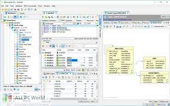
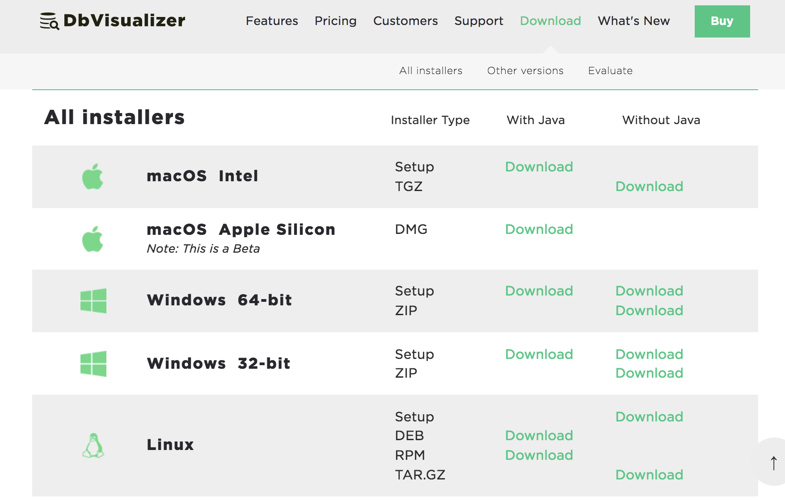
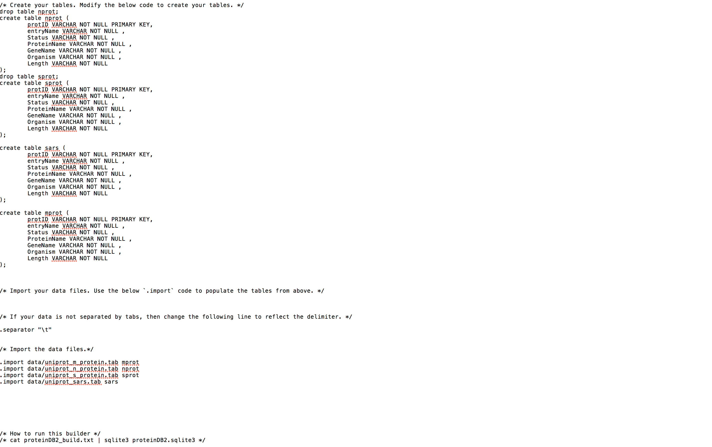

## Data Analytics and SQL

My area of excitement at the moment is in the field of data analytics. Specifically learning SQL and all its features is what is peaking my interest. Learning how to import data sets and put them into a table, and then being able to pick out elements from the tables and answer queries on them. At the moment I have been importing data sets assigned in class but it would be cool to import one of my choosing from an area such as player statistics and analyze it by my own choosing. Another area of interest inside the SQL language I would like to explore is the use of database visualizer tools. One of the tools I have begun to take a look at is SQLitebrowser. With a tool like this I will be able to do all my data analysis inside one window. Being able to see all my ideas easily on one screen will allow me to become better at queries and SQL. With the addition of a tool like this I will also be able to combine my knowledge of data analytics, specifically generating and researching statistical graphs and tables, using a tool like SQLitebrowser. While I do not have a specific file at the moment that I want to use SQL database system to perform research on I am open to a multitude of areas that include sports, cyber security, video games, and psychological data to work with.

## DBVisualizer

### About

This is a visualizer tool for people like me who would like to perform research and analysis using sqlite. My topic will include some data analytics research with predictive models so a tool like this has many features that would be highly beneficial to me.

---

### Features

This software has many features that are useful for me. One of the main thhings I struggle with at the moment is spacing out my work or my thoughts. Using SQLite now I need a terminal window open, and a text editor open to be able to do my work. Having to go back and forth between windows to conduct queriers makes it a lot more tedious to do work than need be. Inisde the terminal is where I type in the query commands, create the table and see my results. Beacuse of all these tasks done in one small window I have to constantly scroll up and down to find my work to reference from which can be frustrating. A tool like DBVisualizer allows you to have all these areas in one whole window which is split up into easy readable sections. This tool has a section where you can see which files you are in and import those csv files to get your data base set up. It has a section where you can run your SQLite code only so you can see all your past lines of code, and it has a section seperate from this that shows the output of this code. This tool also has a window area where you can see your database schema making it much easier to generate queries cause you don't have to go looking for the column titles and database titles each time. 

---

### Obtaining the resource

Where do you find this software resource? Is it an open source project? an online tool? How do you install it? Are there any libraries that are also necessary to install?

This resource is all done throughout its application. There is a free version and a pro version of this tool and is downloaded from the website as an application on your computer. "https://www.dbvis.com/" is where you can download this tool for free. Once in the application you just need to import your data and you are able to create your own database with your own schema and go to work.

---

### Setup

Once installed you may open the application. There are no commands to run this program. You may import your data from your files using .import SQL code, and then create your database schema based off of that. Once your data base is created you have free reign to run query commands to find elements of your database. After this you are able to use the graphing feature to actually visualize your results to see what you are analyzing.

---

### Execution

How do you get the resource ready to use? Are there inputs to know? Please show a step-by-step guide (in a tutorial format) for readying the resource for your work. Include screenshots of successful execution and use of the software.

After opening the application it is all SQL knowledge from there. Here is a sample SQL code of importing downloaded data and creating a table.

---

### Helpful resources

- https://www.dbvis.com/features/
- https://www.dbvis.com/download/

---

